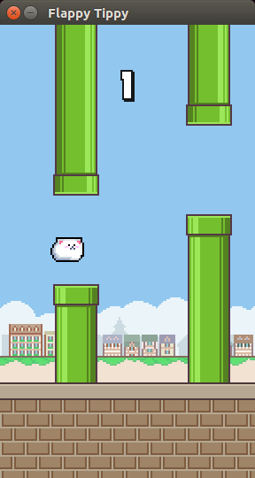

# ティッピーぴょんぴょん (Flappy Tippy)

A Flappy Bird Clone made using [python-pygame](http://www.pygame.org)

非売品です。

## Installation

You can perform a minimal install of requirements with:

```
pip install pygame
pip install six
```

## Playing

Run `python play.py`

Use <kbd>&uarr;</kbd> or <kbd>Space</kbd> key to play and <kbd>Esc</kbd> to close the game.



## References

- [sourabhv/FlapPyBird](https://github.com/sourabhv/FlapPyBird)
- [【ぱちゅコン風ドット】ご注文はうさぎですか?](http://seiga.nicovideo.jp/seiga/im4119007)